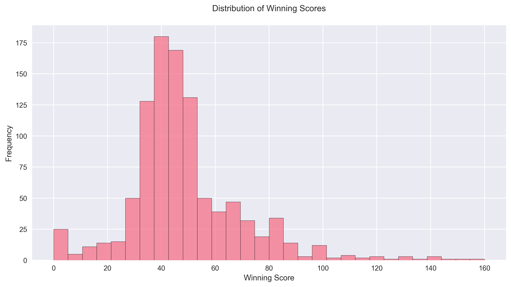
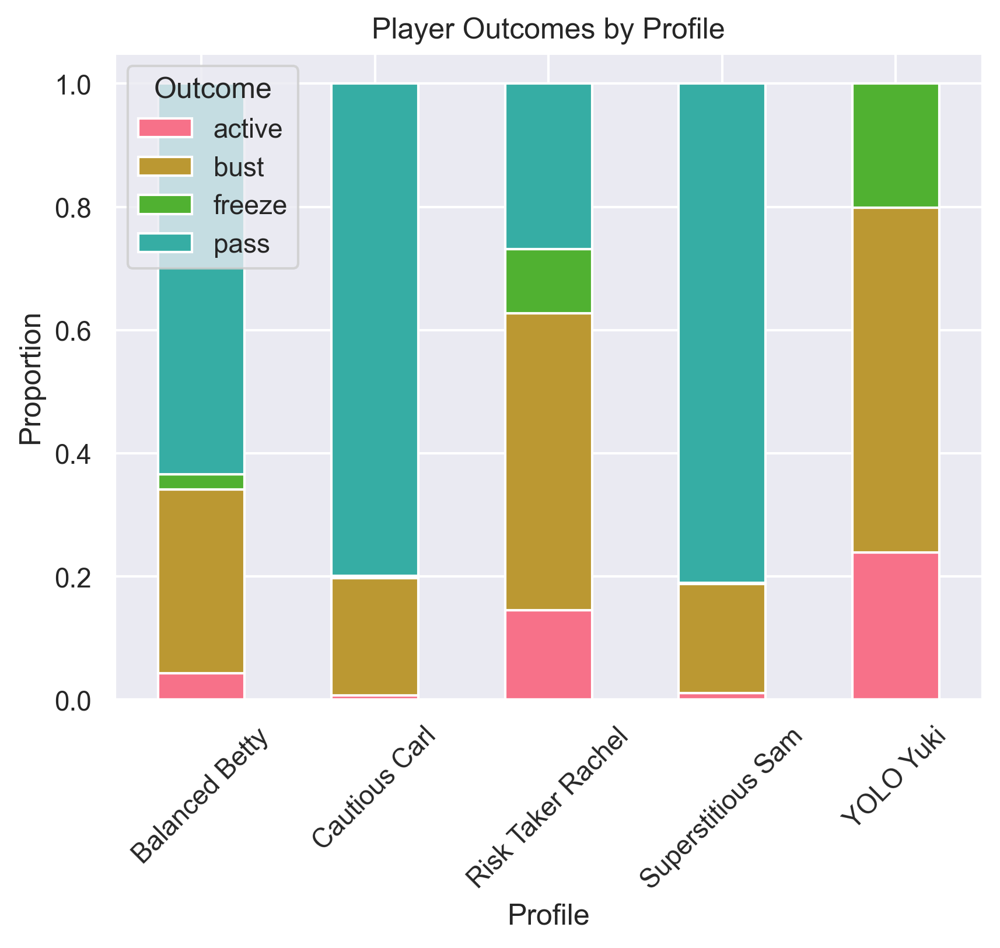
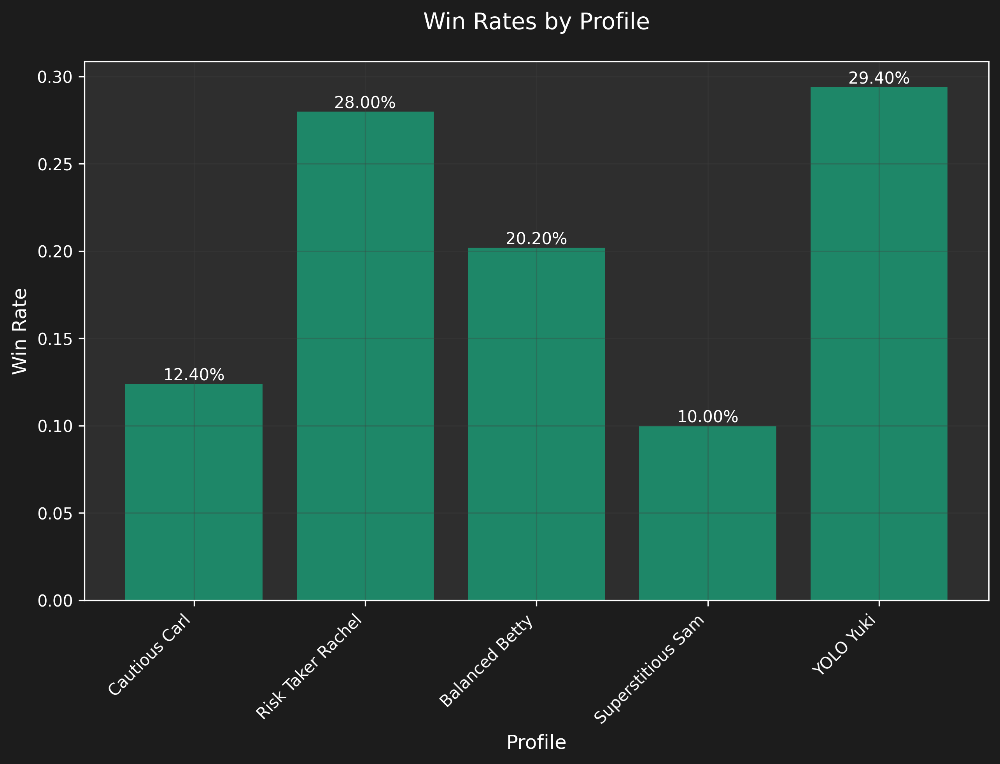
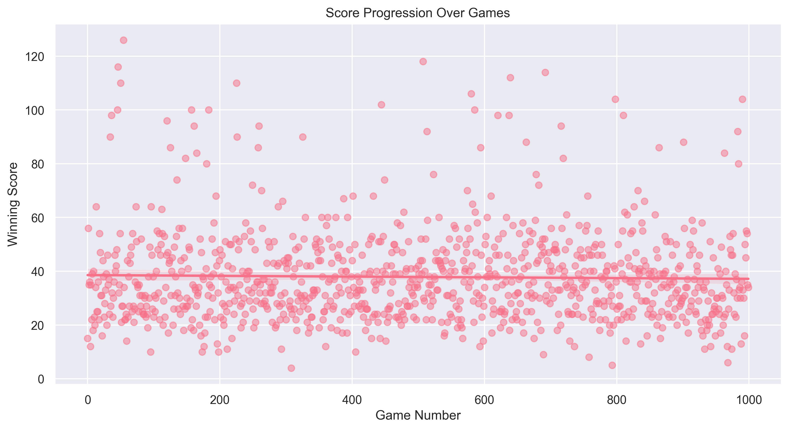
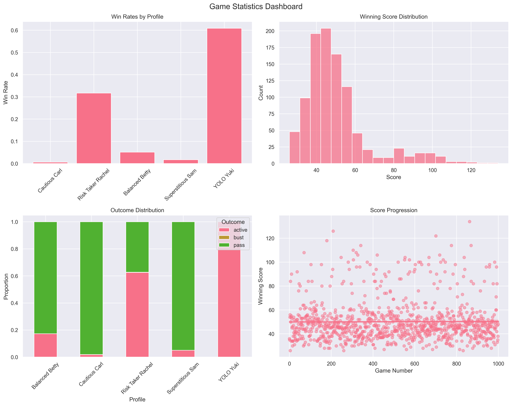

# Flip 7 Game Simulator

A Python-based simulator for the Flip 7 card game, featuring comprehensive game mechanics, statistical analysis, and visualizations.

## Game Overview

Flip 7 is a card game where players aim to collect exactly 7 unique number cards. The game includes:
- Number cards (0-12)
- Action cards (Freeze, Second Chance, Deal Three)
- Modifier cards (+2, +4, +6, +8, +10, x2)

Players take turns drawing cards and must decide when to pass or continue drawing. A player busts if they:
- Draw a duplicate number
- Exceed 7 unique numbers
- Draw a number that makes their total exceed the target

## Project Structure

```
flip7/
├── src/
│   ├── game/
│   │   ├── game.py       # Core game logic
│   │   ├── player.py     # Player class definition
│   │   └── card.py       # Card class and types
│   ├── simulation/
│   │   └── simulator.py  # Simulation engine
│   ├── visualization/
│   │   └── visualizer.py # Visualization tools
│   └── main.py          # Main script
├── tests/               # Test suite
├── output/             # Generated visualizations
└── requirements.txt    # Dependencies
```

## Example Visualizations

The simulator generates several types of visualizations to help analyze game outcomes:

### 1. Winning Scores Distribution

This histogram shows the distribution of winning scores across all simulated games. The visualization helps understand the typical range of winning scores and their frequency.

### 2. Player Outcomes

A stacked bar chart showing the proportion of different outcomes (bust, freeze, pass) for each player. This helps analyze player performance and strategy effectiveness.

### 3. Win Rates

Bar plot displaying the win rate for each player, helping identify if certain player positions have advantages or disadvantages.

### 4. Score Progression

A regression plot showing how winning scores evolve over multiple games, useful for identifying trends or patterns in game outcomes.

### 5. Summary Dashboard

A comprehensive dashboard combining multiple visualizations for a complete overview of the simulation results.

## Installation

1. Clone the repository:
```bash
git clone https://github.com/yourusername/flip7.git
cd flip7
```

2. Create and activate a virtual environment:
```bash
python -m venv venv
source venv/bin/activate  # On Windows: venv\Scripts\activate
```

3. Install dependencies:
```bash
pip install -r requirements.txt
```

## Usage

Run the simulation with default parameters:
```bash
python src/main.py
```

The script will:
1. Run 1000 game simulations
2. Log summary statistics
3. Generate visualizations in the `output/` directory

## Implementation Details

### Game Logic
- Implements complete Flip 7 rules
- Handles all card types and their effects
- Manages player states (active, frozen, passed, busted)

### Simulation Strategy
- Uses Monte Carlo simulation
- Tracks game statistics and player performance
- Implements configurable number of players and games

### Statistics Tracked
- Winning scores
- Player outcomes
- Game duration
- Card distribution
- Strategy effectiveness

## Dependencies

- numpy (>=1.26.0)
- pandas (>=2.1.0)
- matplotlib (>=3.8.0)
- seaborn (>=0.13.0)
- pytest (>=7.4.0)
- loguru (>=0.7.0)
- tqdm (>=4.66.0)

## Contributing

1. Fork the repository
2. Create a feature branch
3. Commit your changes
4. Push to the branch
5. Create a Pull Request

## License

This project is licensed under the MIT License - see the LICENSE file for details.
