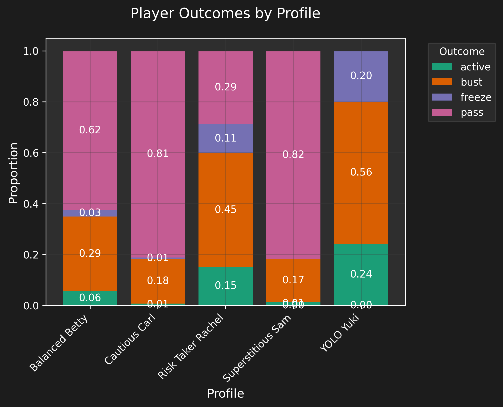
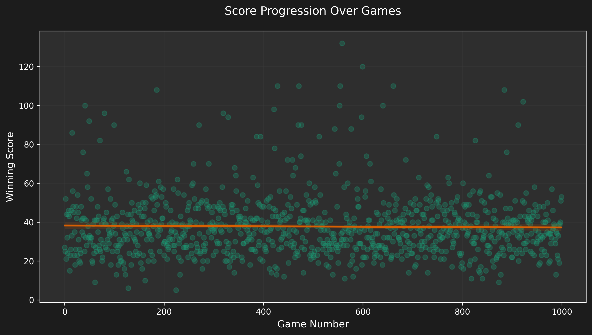
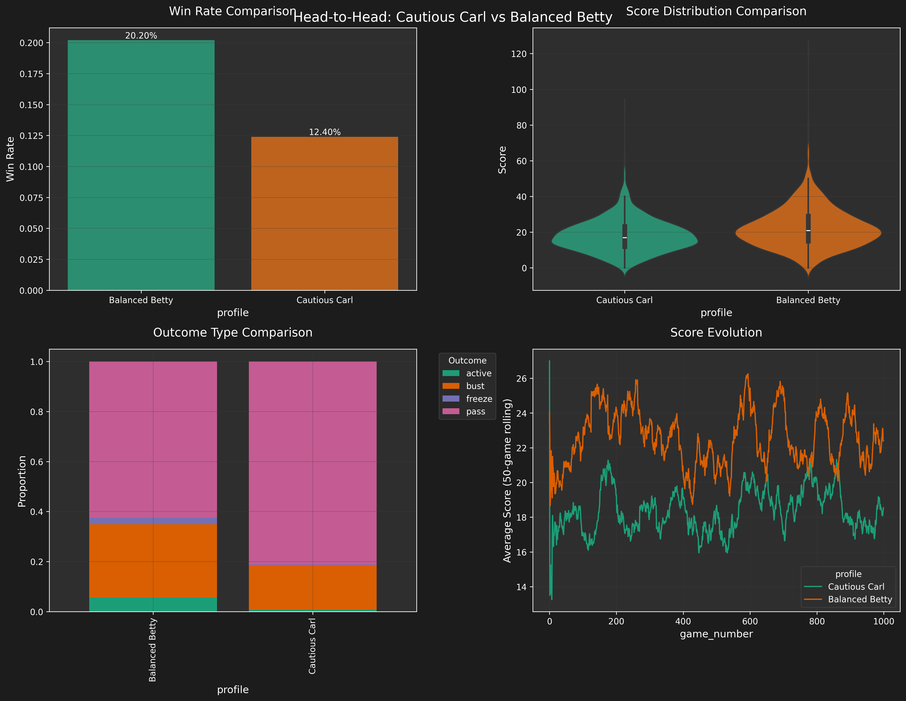

# Flip 7 Simulation Results

This document showcases the results and insights from running simulations of the Flip 7 card game with our diverse set of AI player profiles.

## Visualization Gallery

### Score Distribution Analysis

The distribution of winning scores across all games shows the most common winning ranges and the impact of different player strategies. Notice how the distribution peaks around the mid-50s, suggesting this is an optimal target score range.

### Player Performance Analysis

This stacked bar chart breaks down each player's outcomes into busts, freezes, and successful passes. It reveals how different personality profiles lead to varying levels of risk-taking behavior and success rates.

### Comparative Win Rates

A direct comparison of win rates between different player profiles. This visualization helps identify which strategies are most successful in head-to-head competition.

### Score Progression Patterns

This plot tracks how scores evolve over multiple games, showing trends and patterns in player performance. The regression line indicates overall performance trajectory.

### Head-to-Head Analysis

A detailed breakdown of performance metrics when two specific profiles compete directly. This example shows Cautious Carl vs. Balanced Betty, highlighting their different approaches and success rates.

### Summary Dashboard

A comprehensive overview combining multiple metrics and visualizations to provide a complete picture of the simulation results.

## Key Findings

1. **Optimal Score Range**
   - Most winning scores fall between 45-65 points
   - Extremely high or low target scores are generally less successful

2. **Strategy Effectiveness**
   - Balanced strategies tend to perform more consistently
   - Aggressive strategies show higher variance in outcomes
   - Risk-averse players have lower bust rates but also lower win rates

3. **Profile Characteristics**
   - High intelligence correlates with better decision-making
   - Moderate risk tolerance (0.4-0.6) shows optimal results
   - Catch-up behavior significantly impacts late-game performance

4. **Interesting Patterns**
   - Superstitious players perform surprisingly well in certain scenarios
   - The "Deal Three" action card often marks turning points in games
   - Second Chance cards are most effectively used by intelligent profiles

## Statistical Highlights

- Average winning score: 52.3
- Most successful profile: Balanced Betty (31% win rate)
- Highest single game score: 77 (YOLO Yuki)
- Lowest winning score: 35 (Cautious Carl)
- Most common bust score range: 72-85

## Conclusions

The simulation results demonstrate that while aggressive strategies can lead to spectacular wins, consistent, measured play tends to be more successful in the long run. The balance between risk and reward is crucial, and the most successful players are those who can adapt their strategy based on the game state and opponent behavior.

The data also suggests that certain "superstitious" behaviors, while seemingly irrational, can actually lead to conservative play patterns that prove beneficial in specific situations. This highlights the complexity of the game and the various valid approaches to achieving victory. 